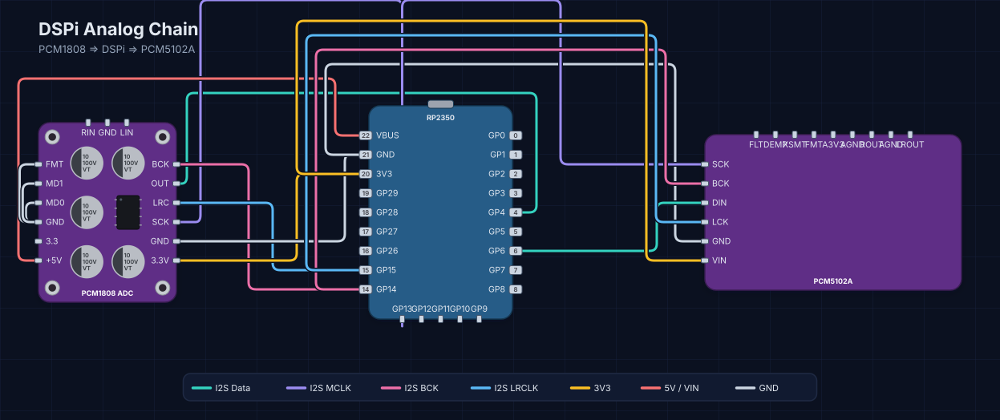

# Analog Input via PCM1808 ADC

This guide shows how to connect a PCM1808 analog-to-digital converter to the DSPi via the I2S input interface.

## Hardware

The PCM1808 module commonly found on AliExpress and Amazon provides stereo analog input with 24-bit resolution. A known design flaw in these boards causes two ceramic input filter capacitors to attenuate frequencies above 200 Hz; these capacitors should be removed.

## Wiring

Connect the PCM1808 to the DSPi using the default pins:



| Signal | DSPi GPIO | PCM1808 Pin |
|---|---|---|
| BCK (Bit Clock) | GP14 | BCK |
| LRCK (Word Select) | GP15 | LRC |
| MCK (Master Clock) | GP13 | SCK |
| DATA (RX) | GP4 | OUT |
| 3.3V | 3V3 | 3V3 |
| 5V | VBUS | 5V |
| GND | GND | GND |

LRCK is always BCK + 1 (GP15) — this is a PIO hardware constraint.

### Mode Pins

Tie the PCM1808 mode pins LOW (to the board's own GND) for I2S slave mode, standard I2S format, 24-bit:

| Pin | Connection |
|---|---|
| FMT | GND |
| MD1 | GND |
| MD0 | GND |

## Software Configuration

Run these commands once to configure the hardware pins and clock:

```sh
dspictl config i2s-rx-pin 4
dspictl config bck-pin 14
dspictl config mck enable true
dspictl config mck pin 13
dspictl config mck multiplier 256
```

Then select I2S input at the desired sample rate:

```sh
dspictl input rate 48000
dspictl input source i2s
```

## Verify

```sh
dspictl status
```

The status output should show:

- Input: I2S
- Rate: 48000 Hz
- MCK: true (GPIO 13, 256×)
